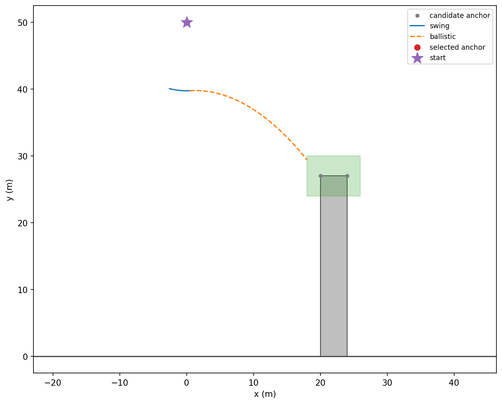
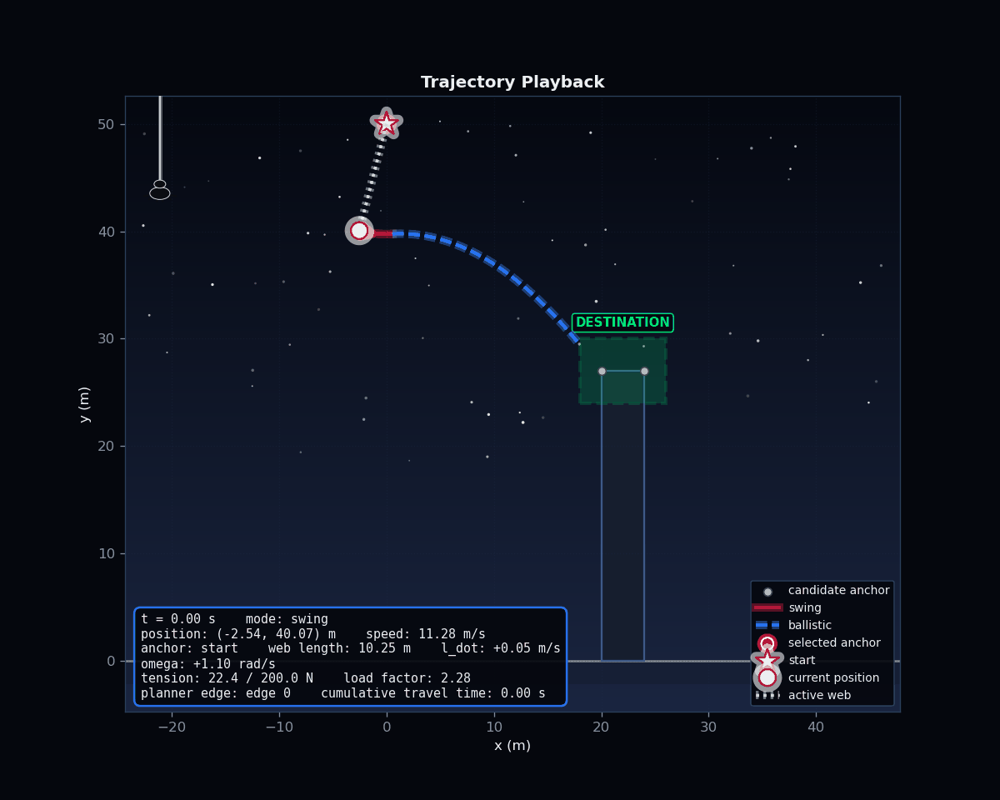

# Kinematic Optimization of Urban Brachistochrone Trajectories

### Anchor Selection and Optimal Control

A physics-based simulation and trajectory optimizer for two-dimensional
urban web-swinging: computing a minimum-time route from a start state to a
destination region by alternating between a controlled, variable-length
pendulum swing on a web and unconstrained ballistic flight after release.

## What it does

- **Dynamics.** Simulates the controlled variable-length pendulum (attached
  swinging) and unconstrained projectile motion (ballistic flight),
  validated against closed-form analytic solutions and energy-conservation
  invariants.
- **Geometry.** Models the city as a deterministic set of building
  polygons, with point-in-polygon, segment-intersection, and
  bounding-box-accelerated collision checks, plus anchor line-of-sight
  validation.
- **Optimization.** Solves a constrained nonlinear program (SLSQP) for each
  swing-to-anchor transfer, respecting web tension, load factor, web-length,
  and radial-speed limits.
- **Planning.** Searches the full city with A* over a discretized swing-state
  graph to find a minimum-time route to a destination region, including
  interception of the destination mid-flight, before an anchor is even
  reached.
- **Visualization.** Renders the resulting route as a static overview plot
  or an animated, frame-by-frame playback with a live telemetry overlay.

## Example

Running the pipeline on a small scenario (one building, one destination
region, a start point above and to the side) produces a route that swings
briefly, releases, and reaches the destination during ballistic flight:



The same route animated, with the active web line, current velocity vector,
and a live telemetry readout:



## Installation

```bash
git clone <repository-url>
cd urban-web-swing-optimization
pip install -e .
```

Requires Python 3.12+, with `numpy`, `scipy`, and `matplotlib` for the
library, and `pytest` for the test suite.

## Usage

```python
import numpy as np

from webswing.config import BallisticDomain, PhysicalParameters, SwingConstraints
from webswing.geometry.buildings import Building, City, DestinationRegion
from webswing.planning.state import PlanningStateResolution
from webswing.simulation.runner import run_simulation
from webswing.visualization.static import render_static_overview

city = City(
    buildings=(
        Building(
            building_id="B1",
            vertices=np.array([[20.0, 0.0], [24.0, 0.0], [24.0, 27.0], [20.0, 27.0]]),
            width=4.0,
            height=27.0,
            roof_elevation=27.0,
            candidate_anchors=((20.0, 27.0), (24.0, 27.0)),
        ),
    ),
    destination=DestinationRegion(x_min=18.0, x_max=26.0, y_min=24.0, y_max=30.0),
)

run = run_simulation(
    start_anchor_id="start",
    start_anchor_position=(0.0, 50.0),
    start_state=np.array([-0.3, 1.0, 10.0, 0.0]),  # [theta, omega, ell, nu]
    city=city,
    params=PhysicalParameters(mass=1.0, gravity=9.80665),
    constraints=SwingConstraints(tension_max=200.0, load_factor_max=20.0, ell_min=1.0, ell_max=30.0, nu_max=5.0),
    resolution=PlanningStateResolution(theta_bin_width=0.1, omega_bin_width=0.2, ell_bin_width=0.5, nu_bin_width=0.1),
    u_min=-0.5,
    u_max=0.5,
    n_control_segments=3,
    t_release_min=0.1,
    t_release_max=3.0,
    capture_radius=4.0,
    ballistic_domain=BallisticDomain(x_min=-200.0, x_max=200.0, y_max=200.0, max_duration=10.0),
)

print(run.success, run.search_result.total_cost)
render_static_overview(city, run.search_result.path, run.trajectory, (0.0, 50.0)).savefig("route.png")
```

See [`examples/basic_run.py`](examples/basic_run.py) for a complete,
runnable version of the example above, including the animated export.

## Running the tests

```bash
pytest
```

The test suite covers dynamics, geometry, optimization, planning,
simulation, and visualization, including analytic-solution comparisons,
energy-conservation checks, boundary cases, and full end-to-end planning
scenarios.

## Project layout

```text
src/webswing/
├── config.py, exceptions.py   # typed parameters and constraints, domain errors
├── dynamics/                  # swing and ballistic equations of motion, events, transitions
├── geometry/                  # buildings, collision detection, anchor visibility
├── optimization/              # control parameterizations, constraints, local transfer solver
├── planning/                  # discretized state graph, A* search, transfer caching
├── simulation/                # trajectory assembly, evaluation, run orchestration
└── visualization/             # static plots, HUD, animation
```

## Scope and limitations

- Routes are minimum-time **within the discretized state graph, candidate
  anchor set, and control parameterization actually used** — this is not a
  proof of global optimality over the continuous problem.
- The A* search defaults to a zero heuristic (equivalent to Dijkstra's
  algorithm); no hard upper bound on achievable speed has been derived for
  this model, so the admissible speed-bound heuristic is available but not
  used by default.
- Collision checking is exact for the geometry it's given, but a straight
  motion segment between two sampled states can still tunnel through an
  obstacle if those states are too far apart.
